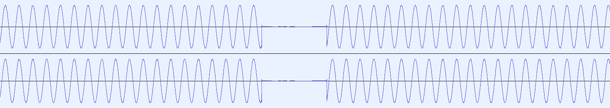
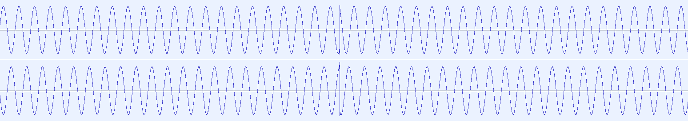

# OBS Asynchronous Audio Source Plugin

## Introduction

This plugin provides a asynchronous audio source to debug audio buffering issues.

I hope this plugin is useful to reproduce and debug the issue.
https://github.com/obsproject/obs-studio/issues/4600

## Properties

### Frequency L, R

The frequency of a sine wave output by this plugin.

### Skew

Make audio data a little slower or faster if set to negative or positive, respectively.

- If you set negative value, you will see a short period of silence.
  
- If you set positive value, you will see a block of dropped samples.
  
- I recommend to set `+/-5000 ppm` so that you will see the issue more than 15 times in a minute.

## Build and install
### Linux
Use cmake to build on Linux. After checkout, run these commands.
```
sed -i 's;${CMAKE_INSTALL_FULL_LIBDIR};/usr/lib;' CMakeLists.txt
mkdir build && cd build
cmake -DCMAKE_INSTALL_PREFIX=/usr -DCMAKE_INSTALL_LIBDIR=/usr/lib ..
make
sudo make install
```
You might need to adjust `CMAKE_INSTALL_LIBDIR` for your system.

### macOS
Use cmake to build on Linux. After checkout, run these commands.
```
mkdir build && cd build
cmake ..
make
```
